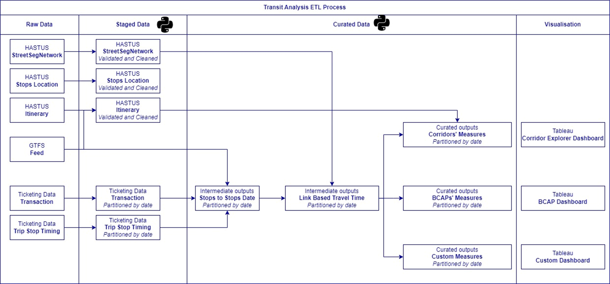

## Introduction

The Transit Analytics Tool is a set of code-based processes that provide insightful statistics on the usage and performance of the bus network at various levels of aggregation.

The Extract, Transform, and Load (ETL) process within the Transit Analytics Tool takes raw input data—such as ticketing data (transactions and trip stop timings), details of scheduled services, and HASTUS inputs (converting bus routes to the underlying road network)—and converts them into curated datasets. These datasets are then used in Tableau dashboards to visualize key performance metrics. The two primary visualization products that leverage these datasets are:

- The **Corridor Explorer (CE) dashboards**: These dashboards allow users to explore bus performance at corridor, segment, and stop levels. They help identify constraints, low-performing sections, or areas of the network that may warrant further investigation. The dashboard data is highly filterable and dissectible, enabling users to create custom views and analyses.
- The **Bus Corridors Action Plan (BCAP) dashboards**: While utilising the same ETL process, BCAP dashboards are designed to spatially identify and quantify bus network performance "hotspots" at the segment level across Southeast Queensland's (SEQ) bus network. The dashboard ranks and compares performance at the segment level using five key metrics related to efficiency and reliability. Users can filter results by road type (e.g., state vs. local roads, busway vs. non-busway), TMR region, and local government area (LGA). Additional data, such as the number of services and passengers, operator feedback [^1], and bus stop utilisation, are included to provide further insights into the nature and magnitude of performance at the segment level.

The overall ETL process, shown in figure below, outlines the high-level steps involved. The resulting outputs are
utilised in Corridor Explorer and BCAP.However, these outputs can also be adapted to support other custom dashboards and
analyses.

[^1]: Bus operators feedback data was obtained through direct engagement of TransLink service planning team with operators across the South East Queensland bus network in December 2020. The same data is used for all analysis period.
{: .fs-1 }